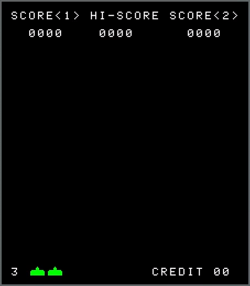
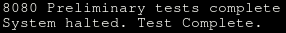
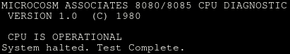
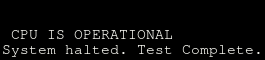
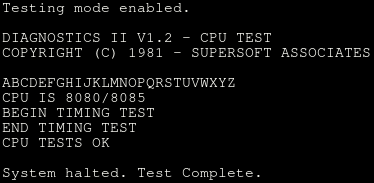
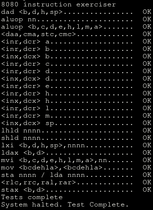
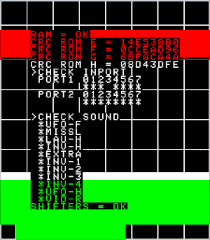

# Invader78

[](https://opensource.org/licenses/MIT)

Tested on:

- Arch Linux

## About

Invader78 is an emulation of the Space Invaders arcade cabinet.



## Resources

[emutalk.net](http://www.emutalk.net/threads/38177-Space-Invaders) for both the idea and the screen layout.

[Computer Archeology](https://computerarcheology.com/Arcade/SpaceInvaders/) for hardware information.

[pastraiser.com](https://pastraiser.com/cpu/i8080/i8080_opcodes.html) for opcode information.

[MAME World](https://samples.mameworld.info/) for the audio samples.

[outerworld arcade](http://outerworldarcade.com/arcade/space_invaders/space_invaders_test_rom.html) for the Modified Space Invaders Test ROM.

[8080](https://github.com/superzazu/8080) by superzazu. This project was used to generate logs to help isolate errors in my code. 

[invaders](https://github.com/superzazu/invaders) by superzazu. The logs generated with this project were crucial to solving a rather maddening video issue.

[Joe's Classic Video Games](https://youtu.be/1uSzmzZP1s8) was used to verify the timing of my emulator against actual hardware, and to correct the screen layout from emutalk.net. The emutalk.net layout shows the lower green portion of the screen as being 72 pixels. This causes the "10 POINTS" portion of the Attract Mode scoring to be green, when it was white on the hardware. Setting the height to 64 pixels corrected the coloring without affecting the shields during gameplay. Click [here](https://youtu.be/1uSzmzZP1s8?t=317) to see the Attract Mode screen on hardware.

The CP/M test programs included in the Resources/ROMs/Test folder.

The 8080 Programmers Manual.

## Requirements

### Linux

- cmake
- SDL2
- Space Invader ROMs

The Space Invader ROMs (invaders.e, invaders.f, invaders.g, invaders.h) should be placed in the Resources/ROMs/SI folder. Do not merge them into a single file.

## Build

### Building on Linux

```bash
cd /path/to/invader78

mkdir build
cd build

cmake -DCMAKE_BUILD_TYPE=Release ..
make
```

## Controls

Some of the controller buttons change functionality depending on whether or not the game is playing or in attract mode. 

Several functions are exclusive to the keyboard: 

- Exit
- Tilt
- Mute
- Cheats

The "cheat" functions to spawn and destroy UFOs were initially added to test and address audio issues with the UFO. The functionality was left in for those who are interested in them. 

The keyboard remains active even with a controller present so you're able to access the cheats, just not as conveniently. The UFO will not spawn until the invaders have reached the right-hand side of the screen, which takes approximately 7 seconds. After that, you can spawn UFOs.  Only one at a time can spawn.

### Keyboard

Key | Functionality
--- | ---
Enter | Inserts a coin
1 | Start a 1-player game
2 | Start a 2-player game
A or Left Arrow | Move to the left
D or Right Arrow | Move to the right
Space | Shoot
M | Mute
P or Pause | Pause / unpause game
Escape | Exit game
End | Tilt game
F12 | Cheat Mode: Spawn UFO
F11 | Cheat Mode: Destroy UFO

### Controller

#### Attract Mode Functionality

Button | Functionality
--- | ---
Start | Inserts a coin
Left Shoulder | Start a 1-player game
Right Shoulder | Start a 2-player game

#### Game Mode Functionality

Button | Functionality
--- | ---
A, B, X, Y, Triggers, or Shoulders | Shoot
D-Pad | Move player left or right
Left Analog | Move player left or right
Start | Pause and unpause game

## Test Results

8080PRE.COM



TST8080.COM



cpudiag.bin



CPUTEST.COM



8080EXM.COM

 

Modified Space Invaders Test ROM

 


## TODO

- Manually test gameplay under Windows and Macintosh
- Automate CPU testing
- Emulate SN76477

